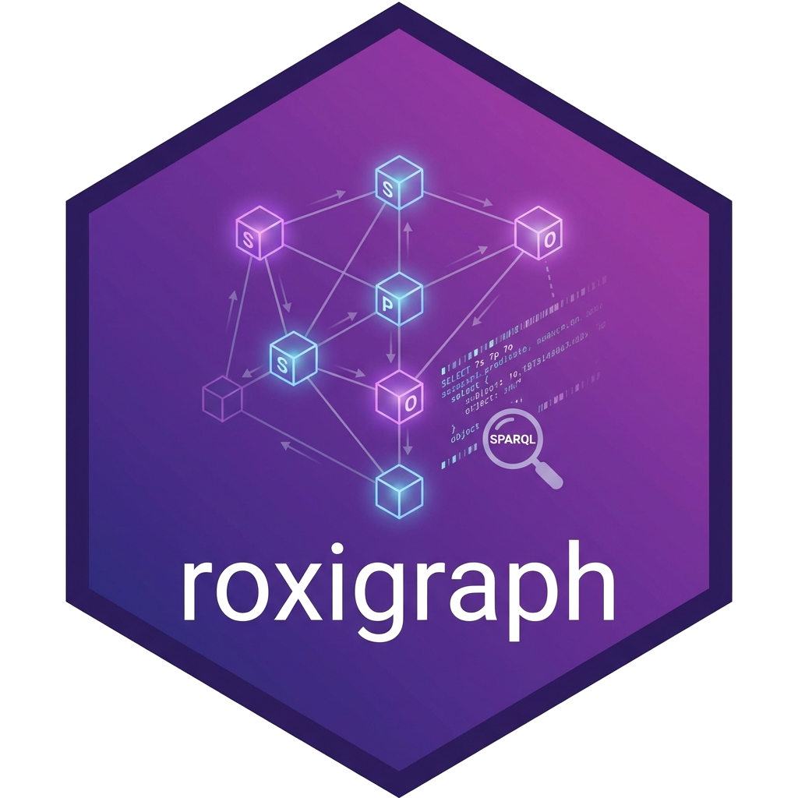

<!-- README.md is generated from README.Rmd. Please edit that file -->


# roxigraph 

<!-- badges: start -->
[](https://github.com/cboettig/roxigraph/actions/workflows/R-CMD-check.yaml)
[](https://CRAN.R-project.org/package=roxigraph)
[](https://cboettig.r-universe.dev/roxigraph)
[](https://opensource.org/licenses/MIT)
<!-- badges: end -->

**roxigraph** provides RDF storage and SPARQL 1.1 query capabilities for R by wrapping the [Oxigraph](https://github.com/oxigraph/oxigraph) graph database library. Built using the [extendr](https://extendr.rs/) framework for high-performance Rust-R bindings.

## Features

- 🚀 **High Performance**: Rust-powered RDF storage with RocksDB backend
- 💾 **Flexible Storage**: In-memory or persistent on-disk databases
- 📄 **Multiple Formats**: Turtle, N-Triples, RDF-XML, N-Quads, TriG
- 🔍 **Full SPARQL 1.1**: Query and Update support

## Installation

### Windows / macOS (recommended)

Install pre-built binaries from [r-universe](https://cboettig.r-universe.dev/roxigraph):

``` r
install.packages("roxigraph", repos = c("https://cboettig.r-universe.dev", "https://cloud.r-project.org"))
```

### Linux (Ubuntu)

For binary installation on Ubuntu (no Rust required):

``` r
# Set up r-universe binary repo for Linux
repo <- sprintf(
  "https://cboettig.r-universe.dev/bin/linux/noble-%s/%s/",
  R.version$arch, substr(getRversion(), 1, 3)
)
install.packages("roxigraph", repos = c(repo, "https://cloud.r-project.org"))
```

### From source (requires Rust)


``` r
# install.packages("pak")
pak::pak("cboettig/roxigraph")
```

Building from source requires:
- **Rust** toolchain (rustc >= 1.65, cargo)
- **libclang-dev** (for RocksDB bindings on Linux)

On Ubuntu/Debian:
```bash
# Install Rust
curl --proto '=https' --tlsv1.2 -sSf https://sh.rustup.rs | sh

# Install libclang
sudo apt-get install libclang-dev
```

## Quick Start


``` r
library(roxigraph)

# Create an in-memory store
store <- rdf_store()

# Load some RDF data (Turtle format)
rdf_load(store, '
@prefix foaf: <http://xmlns.com/foaf/0.1/> .
@prefix ex: <http://example.org/> .

ex:alice foaf:name "Alice" ;
         foaf:knows ex:bob .
ex:bob foaf:name "Bob" .
', format = "turtle")

# Query with SPARQL
sparql_query(store, "
  PREFIX foaf: <http://xmlns.com/foaf/0.1/>
  SELECT ?name WHERE { ?person foaf:name ?name }
  ORDER BY ?name
")
#>      name
#> 1 "Alice"
#> 2   "Bob"

# Check store size
rdf_size(store)
#> [1] 3
```

## Persistent Storage

For data that should persist across R sessions:


``` r
# Create a persistent store
store <- rdf_store("/path/to/my/database")

# Data is automatically persisted to disk
rdf_load(store, data, format = "turtle")
```

## SPARQL Update

Modify your data using SPARQL Update:


``` r
store <- rdf_store()

# Insert data
sparql_update(store, "
  INSERT DATA {
    <http://example.org/alice> <http://xmlns.com/foaf/0.1/name> 'Alice' .
  }
")

# Query the inserted data
sparql_query(store, "SELECT * WHERE { ?s ?p ?o }")
#>         o                                p                          s
#> 1 "Alice" <http://xmlns.com/foaf/0.1/name> <http://example.org/alice>
```

## Serialization

Export your RDF data to various formats:


``` r
store <- rdf_store()
rdf_load(store, '<http://ex.org/s> <http://ex.org/p> "hello" .', format = "ntriples")

# Serialize to N-Quads
cat(rdf_serialize(store, format = "nquads"))
#> <http://ex.org/s> <http://ex.org/p> "hello" .
```

## Learn More

- [Package documentation](https://cboettig.github.io/roxigraph/)
- [Oxigraph](https://github.com/oxigraph/oxigraph) - the underlying Rust library
- [SPARQL 1.1 specification](https://www.w3.org/TR/sparql11-query/)

## License
MIT © Carl Boettiger

Oxigraph is dual-licensed under MIT/Apache-2.0.
